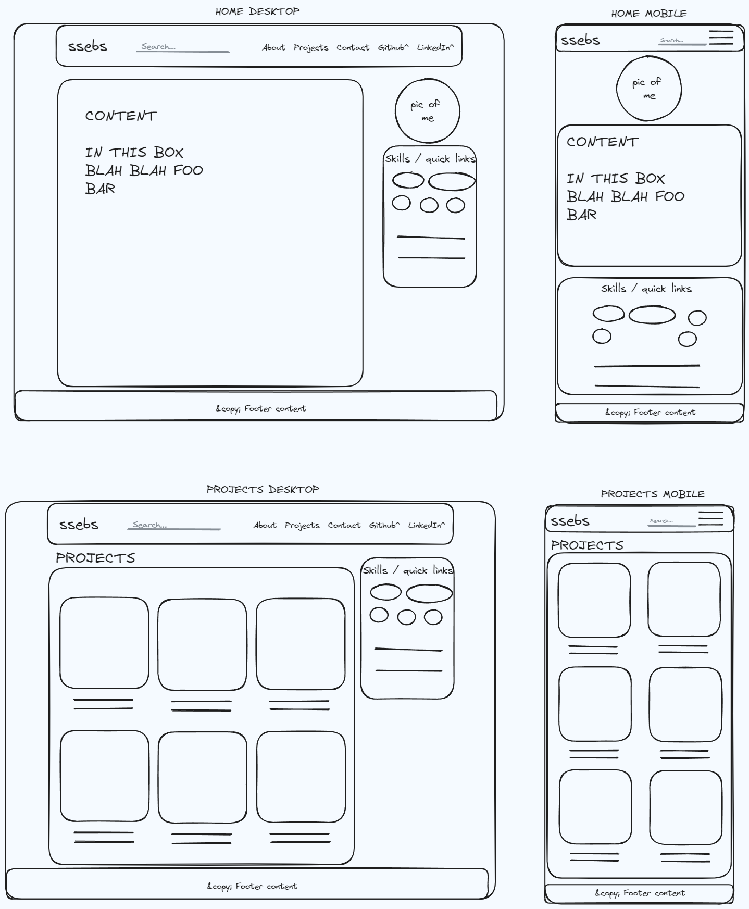

# ssebs-www

ssebs.com website code. 

## TODO:
- [ ] MVP website:
  - All html should be responsive / have mobile first CSS
  - [ ] Base page
    - [ ] Header/navbar
    - [x] .Content
    - [ ] Sidebar w/ pic of me / skills (tags) / quick links
    - [ ] Footer
  - [ ] Pages
    - [ ] Home Page
    - [ ] List page 
      - [ ] Projects
      - [ ] Tags / posts with tag
    - [ ] Single item page 
      - [ ] About
      - [ ] Project
      - [ ] Contact
      - [ ] 404
- [ ] After MVP:
  - [ ] Call to Action / home contents
  - [ ] Add tags to each project and allow search by tags
  - [ ] Add search bar to header
    - [ ] And add Search Results page
- [ ] Finishing touches / Milestone 3:
  - [ ] Install tailwind properly https://tailwindcss.com/blog/standalone-cli
  - [ ] CI/CD Github Actions to build
    - Also do ssebs.github.io?
  - [ ] Animations

### To-Done:
- [x] use tailwind-css + prebuilt components
- [x] Design Layout
- [x] Basic layout
- [x] Make ssebs hugo theme instead of using prebuilt

## Components
- Components lib: https://readymadeui.com/tailwind-components/cards
- Required components:
  - Navbar
  - Collapse
  - Card w/ hover animation
  - Bubbles (tags?)
  - Buttons 
  - Typography

## Design

## Usage
- Clone this repo
- Install [hugo](https://gohugo.io/)
  - Either manually, or use the `setup_env.sh` script
- `hugo serve --noHTTPCache --bind 0.0.0.0`

### Build
- `HUGO_ENV=production hugo`

## License
[MIT](./LICENSE)
